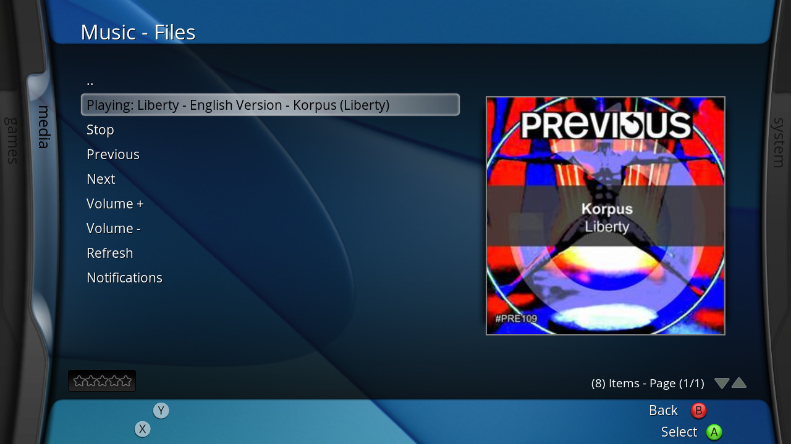

# cortanaMPRIS
## MPRIS notification utility for XBMC4Xbox

### How to Use:
- Download the latest release .zip
- Copy the "cortanaMPRIS" folder to "Q:/plugins/music/"
- Copy "server.py" anywhere on your system, and run it with "python server.py" (this is currently only for Linux users, sorry!). Requires the requests & pillow Python libraries.
- Run the server, then launch the add-on and you should automatically be connected! If that doesn't work, you can go into the add-on settings in XBMC via the context menu and manually specify an IP address to connect to.
- (Optional) To enable notifications, select "Notification" in the main menu (or run Q:/plugins/music/cortanaMPRIS/notifier.py), then listen to a track on your system and watch as a notification pops up with the full track information and cover art!

# Bugs:
- "Pause" is a bit slow due to having to work around a play/pause flicker issue with web apps like Spotify.
