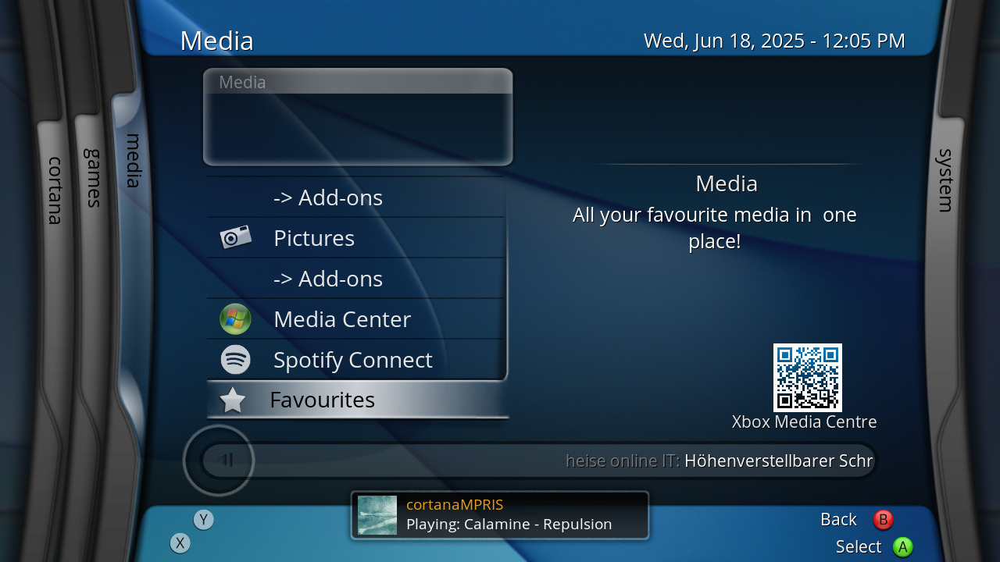
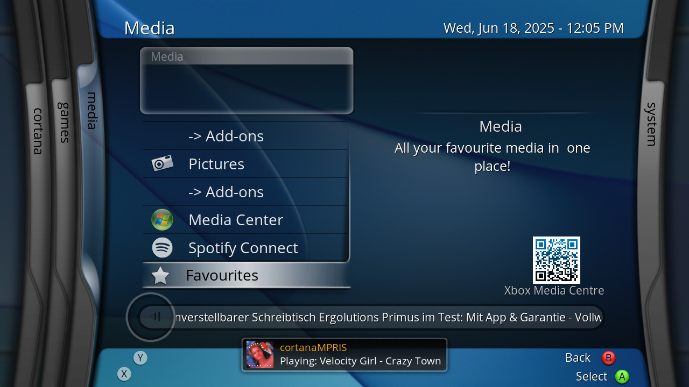

# CortanaMPRIS
## MPRIS notification utility for XBMC4Xbox

### How to Use:
- Copy "default.py" to "Q:/scripts/cortanaMPRIS"
- Copy "server.py" anywhere on your system, and run it with "python server.py" (this is currently only for Linux users, sorry!)
- Listen to a track on your system, and watch as a notification pops up with the full track information and cover art!

# Bugs:
- "Pause" is a bit slow due to having to work around a play/pause flicker issue with web apps like Spotify.
